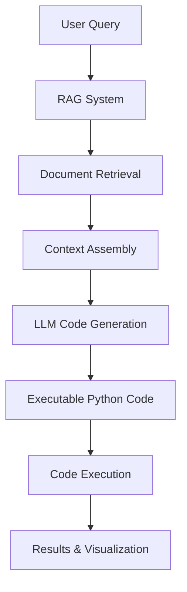

# OV_Agent Integration with Pantheon CLI

## Overview

The OV_Agent system provides a comprehensive RAG (Retrieval-Augmented Generation) framework for bioinformatics code generation and execution, specifically focused on single-cell RNA-seq analysis. Here's how Pantheon CLI integrates with this system to generate and run code.

## OV_Agent System Architecture

### 1. RAG-Based Code Generation System

The OV_Agent uses a sophisticated RAG pipeline that includes:

```python
# Core Components (from OV_Agent/main.py)
- Ollama LLM integration (default: llama3.2:3b)
- FAISS vector store for document retrieval
- HuggingFace embeddings (sentence-transformers/all-MiniLM-L6-v2)
- LangChain RetrievalQA chain
- Annotated code corpus for bioinformatics workflows
```

### 2. Knowledge Base Structure

The system maintains a curated knowledge base of bioinformatics workflows:

#### Annotated Scripts (`OV_Agent/Converted_Scripts_Annotated/`)
- **Format**: Line-by-line commented Python scripts
- **Content**: Complete workflows for single-cell analysis
- **Examples**: 
  - `t_preprocess_annotated.py` - Data preprocessing pipeline
  - `t_cluster_annotated.py` - Cell clustering workflows
  - `t_deg_annotated.py` - Differential expression analysis

#### JSON Descriptions (`OV_Agent/Converted_Jsons/`)
- **Format**: Detailed workflow descriptions
- **Content**: Step-by-step explanations of analysis procedures
- **Purpose**: Context for RAG retrieval and code generation

### 3. Code Generation Process



## How Pantheon Uses OV_Agent

### 1. Query Processing Flow

```python
def process_query(query, data_directory):
    # Initialize RAG system with Ollama LLM
    qa_chain = initialize_rag_system(data_directory)
    
    # Query the RAG system
    result = query_rag_system(qa_chain, query)
    
    return {
        'answer': result['answer'],        # Generated code
        'source_documents': result['source_documents']  # References
    }
```

### 2. Integration with Pantheon Agent System

The Pantheon CLI integrates OV_Agent through multiple pathways:

#### A. Direct Agent Invocation
```bash
# User query triggers single-cell agent (chiron)
pantheon-cli "Analyze my single-cell data with clustering"

# System recognizes "chiron" agent from pantheon-single-cell/
# Agent uses Python interpreter toolset with scanpy
```

#### B. Intent-Based Function Mapping
```bash
# Natural language queries map to specific workflows
pantheon-cli "Normalize counts.h5ad"  # → Uses t_preprocess workflow
pantheon-cli "Find marker genes"      # → Uses t_deg workflow  
pantheon-cli "Cluster cells"          # → Uses t_cluster workflow
```

### 3. Code Generation Examples

#### Example 1: Data Preprocessing
**User Query**: `"How do I preprocess single-cell RNA-seq data?"`

**OV_Agent Response** (based on `t_preprocess_annotated.py`):
```python
import omicverse as ov
import scanpy as sc

# Set plotting style
ov.ov_plot_set()

# Read 10x matrix data
adata = sc.read_10x_mtx(
    'data/filtered_gene_bc_matrices/hg19/',
    var_names='gene_symbols',
    cache=True
)

# Make names unique
adata.var_names_make_unique()
adata.obs_names_make_unique()

# Quality control
adata = ov.pp.qc(adata, 
    tresh={'mito_perc': 0.05, 'nUMIs': 500, 'detected_genes': 250}
)

# Store counts and preprocess
ov.utils.store_layers(adata, layers='counts')
adata = ov.pp.preprocess(adata, mode='shiftlog|pearson', n_HVGs=2000)

# Scale and perform PCA
ov.pp.scale(adata)
ov.pp.pca(adata, layer='scaled', n_pcs=50)
```

#### Example 2: Clustering Analysis  
**User Query**: `"Cluster my preprocessed single-cell data"`

**Generated Code**:
```python
# Compute neighborhood graph
sc.pp.neighbors(adata, n_neighbors=15, n_pcs=50, 
                use_rep='scaled|original|X_pca')

# Perform UMAP
sc.tl.umap(adata)

# Leiden clustering
sc.tl.leiden(adata)

# Visualize results
ov.utils.embedding(adata, basis='X_umap', color='leiden')
```

### 4. Execution Environment

#### Python Interpreter Integration
The pantheon-single-cell agent uses:
```python
from magique.ai.tools.python import PythonInterpreterToolSet

toolset = PythonInterpreterToolSet("scanpy-python-interpreter")
agent = Agent(
    name="chiron",
    instructions="AI-agent for analyzing single-cell RNA-seq data",
    model="gpt-4o-mini"
)

# Remote toolset execution
await agent.remote_toolset(toolset.service_id)
```

#### Code Execution Flow
1. **Code Generation**: OV_Agent RAG system generates Python code
2. **Environment Setup**: Python interpreter toolset initializes
3. **Execution**: Code runs in isolated Python environment
4. **Results**: Output returned to user with visualizations

### 5. Advanced Features

#### A. Workflow Orchestration
```python
# Multi-step analysis pipeline
workflow_steps = [
    "quality_control",      # QC and filtering
    "normalization",        # Data normalization  
    "feature_selection",    # HVG selection
    "dimensionality_reduction", # PCA/UMAP
    "clustering",           # Leiden clustering
    "marker_genes",         # Differential expression
    "visualization"         # Plots and figures
]
```

#### B. Error Handling and Retry
```python
class RetryCallbackHandler(BaseCallbackHandler):
    def on_llm_error(self, error: Exception, **kwargs):
        print(f"Error occurred: {error}")
        time.sleep(1)  # Retry after delay
```

#### C. Resource Management
```python
class OllamaSystemCheck:
    def check_system_resources(self):
        return {
            "memory": memory.available > 4 * 1024**3,  # 4GB
            "disk": disk.free > 10 * 1024**3,          # 10GB
        }
```

## Practical Usage Scenarios

### 1. Complete Analysis Pipeline
```bash
# User provides data path and analysis requirements
pantheon-cli "Analyze /data/pbmc3k.h5ad with full single-cell pipeline"

# System generates and executes:
# 1. Data loading and QC
# 2. Normalization and scaling  
# 3. PCA and UMAP
# 4. Clustering and marker genes
# 5. Visualization and reporting
```

### 2. Specific Analysis Tasks
```bash
# Targeted analysis requests
pantheon-cli "Find differentially expressed genes between clusters"
pantheon-cli "Generate UMAP visualization colored by cell types"
pantheon-cli "Perform trajectory analysis on my data"
```

### 3. Method Comparison
```bash
# Compare different analysis approaches
pantheon-cli "Compare Leiden vs Louvain clustering on my dataset"
pantheon-cli "Test different normalization methods for my data"
```

## System Requirements

### Software Dependencies
```bash
# Core requirements
- Python 3.8+
- Ollama (for LLM inference)
- Node.js 20+ (for Pantheon CLI)

# Python packages
- omicverse
- scanpy  
- langchain
- sentence-transformers
- faiss-cpu
- numpy, pandas, matplotlib
```

### Hardware Requirements
```bash
# Minimum specs
- 4GB RAM (for embeddings and models)
- 10GB disk space (for vector stores)
- GPU optional (for faster inference)
```

## Benefits of Integration

### 1. **Domain-Specific Expertise**
- Curated bioinformatics knowledge base
- Validated single-cell analysis workflows
- Best practices embedded in generated code

### 2. **Reproducible Analysis**
- Version-controlled analysis scripts
- Documented parameter choices
- Standardized output formats

### 3. **Educational Value**
- Line-by-line code explanations
- Method descriptions and rationale
- Learning-oriented code generation

### 4. **Flexibility**
- Support for multiple analysis approaches
- Customizable parameters and thresholds
- Integration with existing data formats

## Future Enhancements

### 1. **Extended Knowledge Base**
- Multi-omics analysis workflows
- Spatial transcriptomics pipelines
- Bulk RNA-seq analysis patterns

### 2. **Interactive Execution**  
- Real-time parameter adjustment
- Interactive visualization widgets
- Step-by-step execution control

### 3. **Results Integration**
- Automatic report generation
- Figure export and formatting
- Integration with research notebooks

This integration makes Pantheon CLI a powerful platform for bioinformatics code generation and execution, combining the flexibility of natural language queries with the rigor of validated analysis workflows.