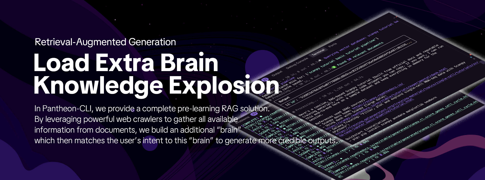

<!-- Banner -->
<p align="center"><a name="readme-top"></a>
  
  
</p>

<div align="center">

# Pantheon CLI

***我们不仅仅在构建另一个 CLI 工具。  
我们正在定义 AI 时代科学家与数据交互的方式。***

**首个完全开源、无限可扩展的科学“聊天式分析”类人框架**

[English](./README.md) · **简体中文** · [官网][official-site] · [更新日志][changelog] · [文档][docs] · [博客][blog] · [反馈][github-issues-link]

[official-site]: https://pantheonos.stanford.edu/
[changelog]: https://pantheonos.stanford.edu/cli/docs/release-notes
[docs]: https://pantheonos.stanford.edu/cli/docs/intro/getting-started
[blog]: https://pantheonos.stanford.edu/news

</div>

<div align="center">

<!-- SHIELD GROUP -->

[![][github-release-shield]][github-release-link]
[![][vercel-shield]][vercel-link]
[![][discord-shield]][discord-link]<br/>
[![][github-contributors-shield]][github-contributors-link]
[![][github-forks-shield]][github-forks-link]
[![][github-stars-shield]][github-stars-link]
[![][github-issues-shield]][github-issues-link]
[![][github-license-shield]][github-license-link]<br>

**分享 Pantheon-CLI 仓库**

[![][share-x-shield]][share-x-link]
[![][share-telegram-shield]][share-telegram-link]
[![][share-whatsapp-shield]][share-whatsapp-link]
[![][share-reddit-shield]][share-reddit-link]
[![][share-weibo-shield]][share-weibo-link]
[![][share-mastodon-shield]][share-mastodon-link]
[![][share-linkedin-shield]][share-linkedin-link]


[](https://www.python.org/downloads/)
[]()
[]()

</div>


## `1` [什么是 Pantheon-CLI？](#)

Pantheon-CLI 是专为科学研究打造的**首个完全开源的“聊天式分析”类人框架**。我们正在定义 AI 时代研究者与数据交互的新方式。

### **博士水平的科学助手**
- Pantheon-CLI 是首个用于复杂真实世界分析的命令行智能（CLI）Agent 助手，能够像人类一样处理博士级别的单细胞与空间组学任务。这不仅是一个工具——**它是一位加入你科研团队的 AI 科学家**。

### **混合式编程** 
- 在同一个环境中，你可以：
  - 第一行写 Python 代码
  - 下一行使用自然语言描述  
  - 甚至混合使用 R/Julia 语言

科学家只需专注于**探索**，无需在不同工具与环境之间来回切换。

## `2` [快速开始与加入社区](#)

我们是一群科研工程师，正在构建首个重塑人机数据交互方式的开源 Python CLI。通过引入 Agent 驱动的对话式工作流，Pantheon-CLI 致力于为各学科的研究人员与开发者提供一个更透明、可复现、且面向未来的数据科学生态。

无论你是生物学家、金融分析师、社会科学家还是机器学习研究者，Pantheon-CLI 都将成为你的下一代分析乐园。请注意，Pantheon-CLI 仍在积极开发中，热忱欢迎你的反馈与贡献。

| [](https://pypi.org/project/pantheon-cli) | `pip install pantheon-cli` |
| :---------------------------------------- | :------------------------------------------------------------ |
| [![][discord-shield-badge]][discord-link] | 加入我们的 Discord！在这里你可以与开发者及热心用户交流。 |

## `3` [功能特性](#)

用 Pantheon-CLI 的开源力量重塑你的数据分析工作流——它为多语言无缝集成、轻松数据分析与下一代科研发现而生。

### 3.1 与数据对话


- 使用 Pantheon-CLI，你可以处理任何本地数据，不局限于文本、CSV、Excel，还包括 anndata、pkl、torch，以及任何 Python/R/Julia 支持的数据格式。
- 你无需将任何数据上传至服务器——分析能力完全依赖于你的计算机。也可以将 Pantheon-CLI 安装在服务器上，解锁无限分析可能。

### 3.2 混合式编程


- 在 Pantheon-CLI 中，所有变量都保存在环境中，我们突破了传统编程的限制。你可以随时用自然语言“编程”，CLI 会自动生成 Python/R/Julia 代码并运行。
- 这是全球首个具备变量持久化支持的 Agent。在编码过程中，你可以随时输入自然语言，Pantheon-CLI 将自动执行你想要的分析。

### 3.3 MCP 集成


- 通过 Pantheon-CLI，我们构建了一个具备人机交互全栈能力的助手：读写文件、创建文件、运行命令、生成代码、读取网页。
- 不同于传统 Agent，我们几乎实现了 Claude Code 的所有能力，并进一步优化——致力于让 Pantheon-CLI 更适合数据分析，而非纯粹的代码编程。

### 3.4 类人行为


- 像人类科学家一样，Pantheon-CLI 可读取网页教程与 PDF 论文，然后开始规划分析。
- 给 LLM 输入教程常能得到更好的输出，但并非所有网页都易于访问。我们重构了更强大的网页抓取能力，尽可能复现人类在分析前会做的一切准备工作。

### 3.5 任务规划


- 在 Pantheon-CLI 中，可从论文中学习并自动规划、构建科学 Agent。学习论文的 Method 部分，像人类专家一样搭建逐步执行的 Agent。
- 对于数据科学任务，现有 Agent 的通用做法是“计划并逐步执行”，但这依赖于人类预先定义的步骤。Pantheon-CLI 则能从论文或教程中自动学习并规划工作流。这与人类专家的做法有何不同？

### 3.6 多模型提供商支持


- Pantheon-CLI 支持主流大模型提供商，包括 OpenAI、Anthropic、Gemini、Deepseek、Qwen 等，因此你不受制于任一模型。
- 这看似简单，却非常实用：我们支持任何大模型，且无需“Claude Code 风格”的专用 API——通用 LLM API 即可。

### 3.7 本地 LLM 支持


- 出于某些数据隐私合规需求，Pantheon-CLI 可基于 ollama 使用本地大模型离线完成数据分析。
- 在本地运行数据与本地运行模型，是 Pantheon-CLI 的另一个有趣优势。

### 3.8 多 RAG 支持



- 我们提供完整的预学习 RAG 方案。通过强大的网页爬虫汇集文档信息，构建一个“外置大脑”，随后将用户意图与之匹配，生成更可靠的输出。
- 虽然 RAG 仍在争论中，但很多时候用户找不到“合适教程”作为精确输入。在这种情况下，RAG 就很有价值——毕竟极长上下文也会消耗大量 tokens。后续我们会释放更大的 RAG 数据库供下载。

### 3.9 生物学支持


- 借助我们在生物组学分析方面的经验，我们预置了系统级组学工具集，帮助你完成上游测序比对、下游注释与差异分析，甚至完整复现一篇生物学论文中的全部分析。


## `4` [详细安装](#)

### 4.1 安装

#### 简单安装（推荐）

```bash
pip install pantheon-cli
```

#### 开发者安装
```bash
# 从源码安装（开发推荐）
git clone https://github.com/aristoteleo/pantheon-cli.git
cd Pantheon-cli
pip install -e .

# 确保依赖已安装
pip install pantheon-agents pantheon-toolsets
```

#### 验证安装
```bash
pantheon-cli --version
```

**说明**：Pantheon-CLI 需要同时安装 `pantheon-agents` 与 `pantheon-toolsets`。它们分别提供核心 Agent 能力与分布式工具集。

### 4.2 基本用法

#### 首次启动
```bash
# 启动 Pantheon-CLI
pantheon-cli
```

系统会引导你配置 API Key 或选择本地模型。若想快速体验，可配置 OpenAI 或 Anthropic 的 API Key。

#### API Key 配置
```bash
# 在 CLI 中设置你的 API Key：
/api-key list  # 列出当前可用的 API Key 及来源

# 全局配置（在任意目录可用）
/api-key openai sk-your-key-here
/api-key anthropic sk-your-key-here
/api-key deepseek sk-your-key-here

# 本地配置（仅当前项目可用）
/api-key openai sk-your-key-here --local
```

#### 配置管理

Pantheon-CLI 支持**全局**与**本地**两种 API Key 存储：

- **全局配置**（`~/.pantheon/config.json`）： 
  - 任何目录都可使用
  - 适合个人固定使用的 Key
  - 使用 `/api-key <provider> <key>`（默认）

- **本地配置**（当前目录的 `.pantheon_config.json`）：
  - 仅在当前项目可用
  - 适用于项目特定或团队环境
  - 使用 `/api-key <provider> <key> --local`

优先级顺序：环境变量 > 本地配置 > 全局配置

#### 启动选项
```bash
# 默认启动
pantheon-cli

# 指定模型
pantheon-cli --model claude-sonnet-4-20250514

# 禁用 RAG 数据库
pantheon-cli --disable_rag

# 指定工作空间
pantheon-cli --workspace /path/to/project

# 启用外部工具集
pantheon-cli --disable_ext False --ext_dir ./ext_toolsets

# 构建 RAG 数据库（需要 SCRAPER_API_KEY 环境变量）
export SCRAPER_API_KEY=2eaca840...
pantheon-cli --build-rag                 # 使用默认配置与输出
pantheon-cli --build-rag custom_output_dir  # 指定输出路径
pantheon-cli --build-rag --rag-config custom.yaml  # 指定配置文件
pantheon-cli --build-rag output_dir --rag-config custom.yaml  # 同时指定
```

### 4.3 使用 RAG 数据库

如果你已经准备好 RAG 数据库：

```bash
pantheon-cli --rag_db path/to/rag/database
```

默认 RAG 数据库路径：`tmp/pantheon_cli_tools_rag/pantheon-cli-tools`。

**注意：如果未找到默认 RAG 数据库，CLI 将自动在“禁用 RAG”模式下运行。**

## `5` [RAG 系统搭建](#5-rag-system-setup)

### 5.1 前置条件

在构建 RAG 数据库前，你需要：
- **OpenAI API Key**：用于生成文本向量
- **ScrapingBee API Key**：用于抓取文档网页

### 5.2 使用全局 API Key 快速构建

最简单的方式是使用内置命令（自动使用全局 API Key）：

```bash
# 首先，确保你已配置所需 API Key
pantheon-cli  # 启动 CLI
/api-key openai sk-your-key-here  # 全局设置 OpenAI Key
exit  # 退出 CLI

# 设置爬虫服务 Key（用于抓取网页）
export SCRAPER_API_KEY=2eaca840...

# 构建 RAG 数据库
pantheon-cli --build-rag

# 或带选项
pantheon-cli --build-rag /path/to/rag/output         # 自定义输出
pantheon-cli --build-rag --rag-config my_config.yaml  # 自定义配置
pantheon-cli --build-rag /path/to/output --rag-config my_config.yaml  # 同时自定义
```

### 5.3 手动构建（可选）

也可以根据配置文件手动构建 RAG 知识库：

```bash
# 设置必要的环境变量
export OPENAI_API_KEY=sk-your-openai-key-here
export SCRAPER_API_KEY=...

# 构建 RAG 数据库
python -m pantheon.toolsets.utils.rag build \
    pantheon/cli/rag_system_config.yaml \
    tmp/pantheon_cli_tools_rag
```

这会在 `tmp/pantheon_cli_tools_rag/pantheon-cli-tools` 生成一个含组学工具文档的向量数据库。

### 5.4 命令行选项

| 选项 | 说明 | 默认值 |
|------|------|--------|
| `--rag_db` | RAG 数据库路径 | `tmp/pantheon_cli_tools_rag/pantheon-cli-tools` |
| `--model` | 使用的 AI 模型 | 读取配置或 `gpt-4.1` |
| `--agent_name` | Agent 名称 | `general_bot` |
| `--workspace` | 工作目录 | 当前目录 |
| `--instructions` | 自定义指令 | 内置指令 |
| `--disable_rag` | 禁用 RAG | `False` |
| `--disable_web` | 禁用 Web 工具 | `False` |
| `--disable_notebook` | 禁用 Notebook 工具 | `False` |
| `--disable_r` | 禁用 R 解释器 | `False` |
| `--disable_julia` | 禁用 Julia 解释器 | `False` |
| `--disable_code_validator` | 禁用代码校验工具 | `False` |
| `--disable_bio` | 禁用生信工具集 | `False` |
| `--disable_ext` | 禁用外部工具集加载 | `True` |
| `--ext_toolsets` | 指定要加载的外部工具集（逗号分隔） | 全部可用 |
| `--ext_dir` | 外部工具集所在目录 | `./ext_toolsets` |


## `6` [可用工具](#6-available-tools)

### 核心工具（始终启用）
- **Shell**：系统命令与组学工具（带自动安装器）
- **Python**：数据分析与可视化（pandas、matplotlib、scanpy）
- **R**：统计分析与 Seurat 单细胞流程（含示例数据）
- **Julia**：高性能科学计算（DataFrames.jl、Plots.jl、DifferentialEquations.jl）
- **文件编辑器**：读取、编辑、创建文件并展示差异
- **代码检索**：查找文件（glob）、搜索内容（grep）、列出目录（ls）
- **代码校验**：验证 Python 代码、命令、函数调用，并检测常见错误
- **Todo**：类 Claude Code 的任务管理，智能拆解并自动推进
- **Generator**：面向任意领域的 AI 外部工具集自动生成
- **Bio Tools**：完善的生物信息学分析流水线（ATAC-seq、RNA-seq 等）

### 可选工具
- **RAG**：内置科研知识的向量检索
- **Web**：带意图识别的智能网页操作
- **Notebook**：Jupyter 笔记本编辑（不执行）

## `7` [配置文件](#7-configuration-files)

Pantheon-CLI 支持类似 Claude Code 的项目级配置文件：

- **`PANTHEON.md`**：项目级配置、命令与规范（可提交至仓库）
- **`PANTHEON.local.md`**：个人偏好与本地设置（建议加入 `.gitignore`）

这些文件会在当前目录或任意父级目录中被自动发现，并纳入 AI 助手的上下文。

**`PANTHEON.md` 示例：**
```markdown
# My Project

## Commands
- Run analysis: `python scripts/analyze.py`
- Quick data load: `%adata = sc.read_h5ad('data.h5ad')`

## Guidelines  
- Use scanpy for Python analysis
- Use Seurat for R analysis
```

详见 [`CONFIG_FILES.md`](CONFIG_FILES.md) 以获取更详细的文档与示例。

## `8` [架构](#8-architecture)

Pantheon-CLI 作为独立包构建，依赖：

- **pantheon-agents**：核心 Agent 能力与推理
- **pantheon-toolsets**：面向多任务的分布式工具集
- 模块化的关注点分离
- 企业级分布式架构设计

### 包结构

```
Pantheon-cli/
├── pantheon_cli/              # 主包（改名以避免冲突）
│   ├── __init__.py           # 入口，包含 cli_main()
│   ├── cli/                  # CLI 实现
│   │   ├── core.py          # 主 CLI 逻辑与工具集集成
│   │   └── manager/         # API Key 与模型管理
│   └── repl/                # REPL 实现  
│       ├── core.py          # REPL 核心（更新后的导入）
│       ├── ui.py            # 界面与工具调用展示
│       └── bio_handler.py   # 生信命令处理
├── pyproject.toml           # 包配置
└── README.md               # 本文件（英文版）
```

## `9` [环境要求](#9-requirements)

- Python 3.10+
- 依赖包：`fire`、`rich`、`pantheon-agents`、`pantheon-toolsets`、`hypha_rpc`、`pandas`
- 可选：R（统计分析）、Julia（高性能科学计算）

## `10` [真实应用场景](#10-real-application-scenarios)

### 生物医学研究
```bash
> 我有一个 10x 单细胞数据集，想要分析 T 细胞分化轨迹

> 加载空间转录组数据并识别组织结构中的基因表达模式

> 整合多组学数据以寻找疾病相关生物标志物
```

### 数据科学分析
```bash
> 对这份销售数据进行时间序列分析与预测

> 构建一个机器学习模型来预测用户流失

> 使用深度学习分析这些医学图像
```

### 教学与学习
```bash
> 讲解主成分分析（PCA）的原理并配合代码演示

> 对比不同聚类算法在该数据集上的表现

> 展示 A/B 测试的统计分析流程
```

## `11` [为何选择 Pantheon-CLI？](#11-why-choose-pantheon-cli)

### 颠覆式能力，对比传统工具

**前所未有的“与数据聊天”**
- 传统：只支持简单 CSV，且需要预处理
- Pantheon-CLI：可直接通过对话处理任意本地数据格式（anndata、pkl、torch 等）

**混合式编程环境**
- 传统：在 Python、R、Julia 环境间来回切换
- Pantheon-CLI：多语言无缝集成，跨环境变量持久化

**先进的 Web 智能**
- 传统：手工搜索与复制粘贴
- Pantheon-CLI：自动读取教程、PDF、网页，进行上下文感知分析

**类人的科研行为**
- 传统：固定的、刚性的预设分析流程
- Pantheon-CLI：从论文与教程中学习，像科学家一样规划分析

**智能 RAG 知识库**
- 传统：散落文档需要人工搜索
- Pantheon-CLI：内置科研知识库，自动匹配相关文档

**多模型提供商支持**
- 传统：被单一提供商锁定
- Pantheon-CLI：支持 OpenAI、Anthropic、Gemini、DeepSeek、Qwen 等

**隐私完全可控**
- 传统：数据需上传云端
- Pantheon-CLI：支持本地 LLM（Ollama），离线分析

**领域特定专家能力**
- 传统：通用 AI 缺乏专业知识
- Pantheon-CLI：内置生物信息学知识与完整组学分析流水线

**任务规划与自动化**
- 传统：手动逐步执行
- Pantheon-CLI：自动从科研文献学习与规划工作流

**无限可扩展**
- 传统：受限于预置特性
- Pantheon-CLI：面向任意领域的 AI 工具集自动生成

## `12` [参与贡献](#12-contributing)

我们欢迎各种形式的贡献；如果你希望贡献代码，欢迎关注 GitHub 的 [Issues][github-issues-link] 与 [Projects][github-project-link]，向我们展示你的实力。

> \[!TIP]
>
> 我们正在打造一个技术驱动的社区，促进知识互动与思想交流，激发彼此灵感与合作创新。
>
> 帮助我们把 Pantheon-CLI 做得更好。欢迎直接向我们提供产品设计反馈与用户体验建议。
>
> **主要维护者：** [@starlitnightly](https://github.com/starlitnightly) [@Nanguage](https://github.com/Nanguage)

[![][pr-welcome-shield]][pr-welcome-link]
[![][submit-agents-shield]][submit-agents-link]
[![][submit-plugin-shield]][submit-plugin-link]

<details><summary><h4>📝 许可证</h4></summary>

[![][fossa-license-shield]][fossa-license-link]

</details>

版权所有 © 2025 [Qiu Lab](https://www.devo-evo.com/)。<br />
本项目使用 [Apache 2.0](./LICENSE) 许可证。


[github-contributors-link]: https://github.com/aristoteleo/pantheon-cli/graphs/contributors
[github-contributors-shield]: https://img.shields.io/github/contributors/aristoteleo/pantheon-cli?color=c4f042&labelColor=black&style=flat-square
[github-forks-link]: https://github.com/aristoteleo/pantheon-cli/network/members
[github-forks-shield]: https://img.shields.io/github/forks/aristoteleo/pantheon-cli?color=8ae8ff&labelColor=black&style=flat-square
[github-issues-link]: https://github.com/aristoteleo/pantheon-cli/issues
[github-issues-shield]: https://img.shields.io/github/issues/aristoteleo/pantheon-cli?color=ff80eb&labelColor=black&style=flat-square
[github-license-link]: https://github.com/aristoteleo/pantheon-cli/blob/main/LICENSE
[github-license-shield]: https://img.shields.io/badge/license-apache%202.0-white?labelColor=black&style=flat-square
[github-release-link]: https://github.com/aristoteleo/pantheon-cli/releases
[github-release-shield]: https://img.shields.io/github/v/release/aristoteleo/pantheon-cli?color=369eff&labelColor=black&logo=github&style=flat-square
[github-project-link]: https://github.com/aristoteleo/pantheon-cli/projects
[github-releasedate-link]: https://github.com/aristoteleo/pantheon-cli/releases
[github-releasedate-shield]: https://img.shields.io/github/release-date/aristoteleo/pantheon-cli?labelColor=black&style=flat-square
[github-stars-link]: https://github.com/aristoteleo/pantheon-cli/network/stargazers
[github-stars-shield]: https://img.shields.io/github/stars/aristoteleo/pantheon-cli?color=ffcb47&labelColor=black&style=flat-square
[github-trending-shield]: https://trendshift.io/api/badge/repositories/2256
[github-trending-url]: https://trendshift.io/repositories/2256


[vercel-link]: https://pantheonos.stanford.edu/
[vercel-shield]: https://img.shields.io/badge/vercel-online-55b467?labelColor=black&logo=vercel&style=flat-square
[discord-link]: https://discord.gg/74yzAGYW
[discord-shield]: https://img.shields.io/discord/1407066076860125184?color=5865F2&label=discord&labelColor=black&logo=discord&logoColor=white&style=flat-square
[discord-shield-badge]: https://img.shields.io/discord/1407066076860125184?color=5865F2&label=discord&labelColor=black&logo=discord&logoColor=white&style=for-the-badge

[share-linkedin-link]: https://linkedin.com/feed
[share-linkedin-shield]: https://img.shields.io/badge/-share%20on%20linkedin-black?labelColor=black&logo=linkedin&logoColor=white&style=flat-square
[share-mastodon-link]: https://mastodon.social/share?text=Check%20this%20GitHub%20repository%20out%20%F0%9F%A4%AF%20Pantheon%20CLI%20-%20The%20first%20fully%20open-source%2C%20infinitely%20extensible%20scientific%20%22vibe%20analysis%22%20framework.%20An%20AI-driven%20scientific%20intelligent%20agent%20for%20PhD-level%20research%20tasks.%20https://github.com/aristoteleo/pantheon-cli%20%23scientific%20%23AI%20%23bioinformatics
[share-mastodon-shield]: https://img.shields.io/badge/-share%20on%20mastodon-black?labelColor=black&logo=mastodon&logoColor=white&style=flat-square
[share-reddit-link]: https://www.reddit.com/submit?title=Check%20this%20GitHub%20repository%20out%20%F0%9F%A4%AF%20Pantheon%20CLI%20-%20The%20first%20fully%20open-source%2C%20infinitely%20extensible%20scientific%20%22vibe%20analysis%22%20framework.%20An%20AI-driven%20scientific%20intelligent%20agent%20for%20PhD-level%20research%20tasks.%20%23scientific%20%23AI%20%23bioinformatics&url=https%3A%2F%2Fgithub.com%2Faristoteleo%2Fpantheon-cli
[share-reddit-shield]: https://img.shields.io/badge/-share%20on%20reddit-black?labelColor=black&logo=reddit&logoColor=white&style=flat-square
[share-telegram-link]: https://t.me/share/url"?text=Check%20this%20GitHub%20repository%20out%20%F0%9F%A4%AF%20Pantheon%20CLI%20-%20The%20first%20fully%20open-source%2C%20infinitely%20extensible%20scientific%20%22vibe%20analysis%22%20framework.%20An%20AI-driven%20scientific%20intelligent%20agent%20for%20PhD-level%20research%20tasks.%20%23scientific%20%23AI%20%23bioinformatics&url=https%3A%2F%2Fgithub.com%2Faristoteleo%2Fpantheon-cli
[share-telegram-shield]: https://img.shields.io/badge/-share%20on%20telegram-black?labelColor=black&logo=telegram&logoColor=white&style=flat-square
[share-weibo-link]: http://service.weibo.com/share/share.php?sharesource=weibo&title=Check%20this%20GitHub%20repository%20out%20%F0%9F%A4%AF%20Pantheon%20CLI%20-%20The%20first%20fully%20open-source%2C%20infinitely%20extensible%20scientific%20%22vibe%20analysis%22%20framework.%20An%20AI-driven%20scientific%20intelligent%20agent%20for%20PhD-level%20research%20tasks.%20%23scientific%20%23AI%20%23bioinformatics&url=https%3A%2F%2Fgithub.com%2Faristoteleo%2Fpantheon-cli
[share-weibo-shield]: https://img.shields.io/badge/-share%20on%20weibo-black?labelColor=black&logo=sinaweibo&logoColor=white&style=flat-square
[share-whatsapp-link]: https://api.whatsapp.com/send?text=Check%20this%20GitHub%20repository%20out%20%F0%9F%A4%AF%20Pantheon%20CLI%20-%20The%20first%20fully%20open-source%2C%20infinitely%20extensible%20scientific%20%22vibe%20analysis%22%20framework.%20An%20AI-driven%20scientific%20intelligent%20agent%20for%20PhD-level%20research%20tasks.%20https://github.com/aristoteleo/pantheon-cli%20%23scientific%20%23AI%20%23bioinformatics
[share-whatsapp-shield]: https://img.shields.io/badge/-share%20on%20whatsapp-black?labelColor=black&logo=whatsapp&logoColor=white&style=flat-square
[share-x-link]: https://x.com/PantheonOS
[share-x-shield]: https://img.shields.io/badge/-share%20on%20x-black?labelColor=black&logo=x&logoColor=white&style=flat-square

[pr-welcome-link]: https://github.com/aristoteleo/pantheon-cli/pulls
[pr-welcome-shield]: https://img.shields.io/badge/👌_pr_welcome-%E2%86%92-ffcb47?labelColor=black&style=for-the-badge

[submit-agents-link]: https://github.com/aristoteleo/pantheon-agents
[submit-agents-shield]: https://img.shields.io/badge/🤖/🏪_submit_agent-%E2%86%92-c4f042?labelColor=black&style=for-the-badge
[submit-plugin-link]: https://github.com/aristoteleo/pantheon-toolsets
[submit-plugin-shield]: https://img.shields.io/badge/🧩/🏪_submit_toolsets-%E2%86%92-95f3d9?labelColor=black&style=for-the-badge

[fossa-license-link]: https://app.fossa.com/projects/git%2Bgithub.com%2FStarlitnightly%2Fpantheon-cli
[fossa-license-shield]: https://app.fossa.com/api/projects/git%2Bgithub.com%2FStarlitnightly%2Fpantheon-cli.svg?type=large
